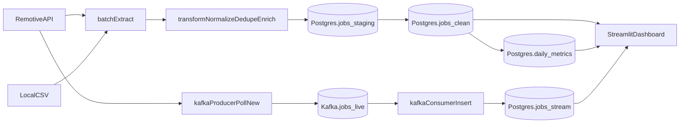

# Job Market Intelligence Pipeline

End-to-end (batch + streaming) data engineering pipeline for tech job postings:

- **Batch ingestion**: Remotive Jobs API (JSON) + local CSV file.
- **Streaming ingestion**: Kafka topic `jobs_live` with a producer (polls Remotive) and consumer (inserts into Postgres).
- **Storage**: PostgreSQL tables (`jobs_staging`, `jobs_clean`, `jobs_stream`, `daily_metrics`).
- **Visualization**: Streamlit dashboard reading directly from Postgres.

## Architecture



## Tech stack (free/open-source)
- Python, requests, pandas
- PostgreSQL
- Apache Kafka (+ Zookeeper)
- Streamlit
- Docker Compose
- pytest

## Setup

1) Create a local `.env` (do not commit it). Start from `.env.example`.

2) Start the stack:

```bash
docker compose up --build
```

3) Open the dashboard:
- `http://localhost:8501`

## Step-by-step lifecycle (recommended demo flow)

1) Start infra (Postgres + Kafka):

```bash
docker compose up -d postgres zookeeper kafka
```

2) Run the batch pipeline once (loads `jobs_clean` + `daily_metrics`):

```bash
docker compose run --rm batch
```

3) Start the dashboard:

```bash
docker compose up --build app
```

4) Start streaming ingestion (optional, in 2 terminals):

```bash
docker compose up --build producer
```

```bash
docker compose up --build consumer
```

5) Tear down:

```bash
docker compose down
```

## Local (non-Docker) option: virtual environment

```bash
python -m venv .venv
.\.venv\Scripts\Activate.ps1
pip install -r requirements.txt
pytest -q
```

## Run batch ETL

```bash
docker compose run --rm batch
```

## Run streaming ingestion

In two terminals:

```bash
docker compose up --build producer
```

```bash
docker compose up --build consumer
```

## Run tests

```bash
docker compose run --rm app pytest -q
```

## Data sources
- Remotive Jobs API (public JSON API)
- Local CSV file at `data/raw/jobs.csv`

